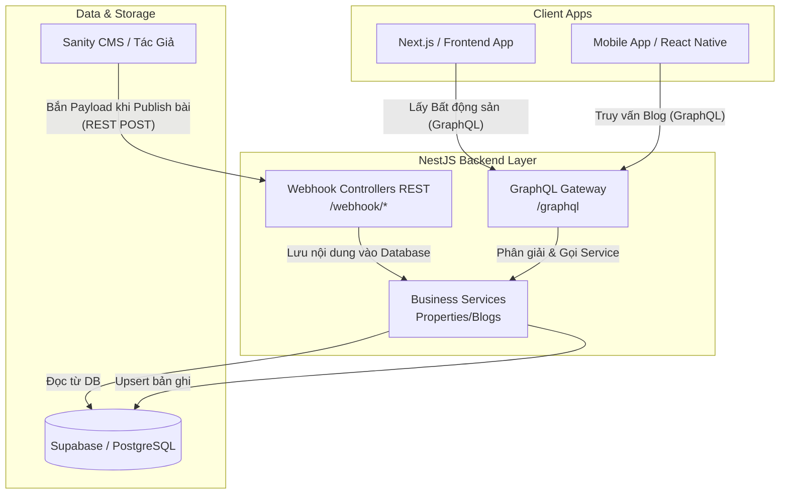

# NestJS Headless API - Integration Guide

Tài liệu này mô tả kiến trúc và hướng dẫn cách tích hợp các dự án Front-End (Next.js, Vue, React Native, v.v.) và CMS (Sanity, Strapi) với hệ thống Backend này.

## Kiến Trúc Hệ Thống (Architecture Design)

Hệ thống được thiết kế theo hình mẫu **Backend-BFF (Backend for Frontend)**, đóng vai trò như một Proxy thông minh đứng giữa Dữ liệu và các Giao diện người dùng.



---

## 1. Hướng Dẫn Dành Cho Dự Án Giao Diện (Front-End)

Bất kể bạn dùng Next.js, Flutter, React Native hay framework khác, bạn chỉ cần một **GraphQL Client** (ví dụ: Apollo Client, urql, hoặc dùng `fetch` thông thường) trỏ tới API của hệ thống.

**Thông tin truy cập:**
- **URL**: `http://<domain-backend>/graphql` (Localhost mặc định là `3001`).
- **Method**: `POST`
- **Headers**:
  ```json
  { "Content-Type": "application/json" }
  ```

### Ví dụ Query Mẫu: Đọc Dữ Liệu Bất Động Sản
```graphql
query GetLandingPageData {
  properties {
    id
    name
    price
    location
    img_url
  }
}
```

### Ví dụ JSON Body (Dùng fetch thông thường)
```javascript
const response = await fetch('http://localhost:3001/graphql', {
  method: 'POST',
  headers: { 'Content-Type': 'application/json' },
  body: JSON.stringify({
    query: `
      query GetProperties {
        properties {
          id
          name
        }
      }
    `
  }),
});
const { data } = await response.json();
```

---

## 2. Hướng Dẫn Tích Hợp CMS (Sanity / Hệ Thống Khác)

Backend mở sẵn các cổng **REST Webhook** để nhận dữ liệu sự kiện (như *Publish Bài*, *Sửa Bài*, *Xóa Bài*) và đồng bộ hóa lưu trữ vĩnh viễn vào cơ sở dữ liệu Supabase.

Cổng giao tiếp mặc định:
- **Properties**: `POST /webhook/properties`
- **Blogs**: `POST /webhook/blogs`

### Cách Cấu Hình Bên CMS:
1. Đăng nhập vào trang quản trị của CMS.
2. Tìm hệ thống **Webhooks** (API Hooks).
3. Thêm Webhook URL của NestJS Backend.
4. Chọn điều kiện kích hoạt.
5. Khi người soạn thảo bấm Publish, luồng dữ liệu tự động đổ vào Backend.

> **Lưu ý Cấu trúc Payload (Dữ liệu gửi từ CMS):**
> Trong các file `*.controller.ts` của NestJS, định dạng bóc tách Payload hiện được code cho tương thích bản đồ JSON bắn từ Sanity (`payload._id`, `payload.title`, v.v.). Nếu tương lai bạn dùng một CMS khác (như WordPress, Ghost, Strapi), hãy vào các thư mục `controller.ts` chỉnh lại key trích xuất (Mapping Payload) cho khớp với CMS mới là xong.

ALTER TABLE public.locations DISABLE ROW LEVEL SECURITY;
ALTER TABLE public.projects DISABLE ROW LEVEL SECURITY;
ALTER TABLE public.project_amenities DISABLE ROW LEVEL SECURITY;
ALTER TABLE public.project_floorplans DISABLE ROW LEVEL SECURITY;
ALTER TABLE public.properties DISABLE ROW LEVEL SECURITY;
ALTER TABLE public.blogs DISABLE ROW LEVEL SECURITY;